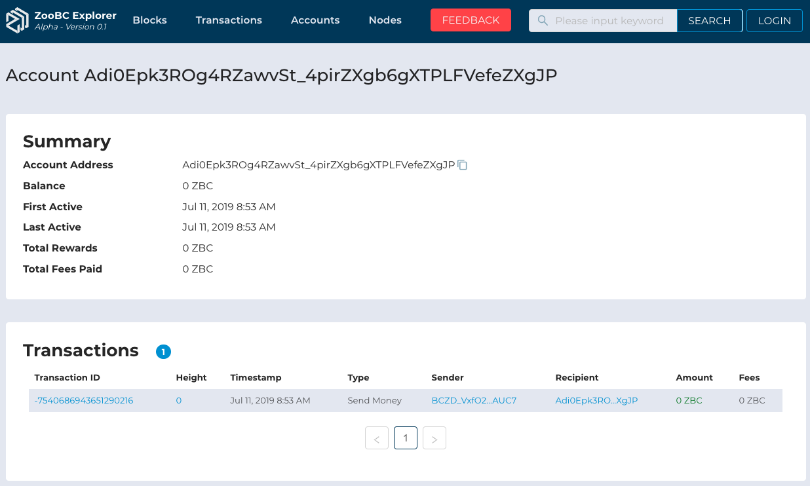

> 🔗 __*Quicklinks*:__ Application URL of [Transaction Detail][account-detail]

> ⚠️ These properties are still developing on our ZooBC Core, so if there's an empty value we use status `undefined`.

[account-detail]: https://zoobc.net/accounts/Adi0Epk3ROg4RZawvSt_4pirZXgb6gXTPLFVefeZXgJP

## Properties

  
__*Figure 1.16*__ : Properties of Transaction Type as Send Money

   
  

* **Account Address** : Lorem ipsum dolor sit amet, consectetur adipiscing elit, sed do eiusmod tempor incididunt ut labore et dolore magna aliqua. _e.g._ `Adi0Epk3ROg4RZawvSt_4pirZXgb6gXTPLFVefeZXgJP`.

* **Balance** : Lorem ipsum dolor sit amet, consectetur adipiscing elit, sed do eiusmod tempor incididunt ut labore et dolore magna aliqua. _e.g._ `0 ZBC`.

* **First Active** : Lorem ipsum dolor sit amet, consectetur adipiscing elit, sed do eiusmod tempor incididunt ut labore et dolore magna aliqua. _e.g._ `Jul 11, 2019 8:53 AM`.

* **Last Active** : Lorem ipsum dolor sit amet, consectetur adipiscing elit, sed do eiusmod tempor incididunt ut labore et dolore magna aliqua. _e.g._ `Jul 11, 2019 8:53 AM`.

* **Total Rewards** : Lorem ipsum dolor sit amet, consectetur adipiscing elit, sed do eiusmod tempor incididunt ut labore et dolore magna aliqua. _e.g._ `0 ZBC`.

* **Total Fees Paid** : Lorem ipsum dolor sit amet, consectetur adipiscing elit, sed do eiusmod tempor incididunt ut labore et dolore magna aliqua. _e.g._ `0 ZBC`.
