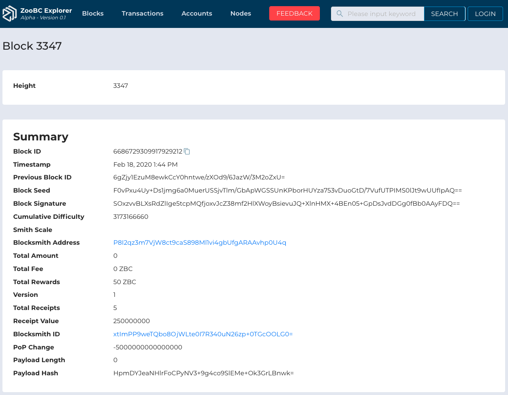

> 🔗 __*Quicklinks*:__ Application URL of [Block Detail][block-detail]

> ⚠️ These properties are still developing on our ZooBC Core, so if there's an empty value we use status `undefined`.

[block-detail]: https://zoobc.net/blocks/6686729309917929212

## Properties

  
__*Figure 1.8*__ : Properties of Block Detail

   
  

* **Block ID** : Lorem ipsum dolor sit amet, consectetur adipiscing elit, sed do eiusmod tempor incididunt ut labore et dolore magna aliqua. _e.g._ `6686729309917929212`.

* **Timestamp** : Lorem ipsum dolor sit amet, consectetur adipiscing elit, sed do eiusmod tempor incididunt ut labore et dolore magna aliqua. _e.g._ `Feb 18, 2020 1:44 PM`.

* **Previous Block ID** : Lorem ipsum dolor sit amet, consectetur adipiscing elit, sed do eiusmod tempor incididunt ut labore et dolore magna aliqua. _e.g._ `F0vPxu4Uy+Ds1jmg6a0MuerUSSjvTlm/GbApWGSSUnKPborHUYza753vDuoGtD/7VufUTPIMS0lJt9wUUfIpAQ==`.

* **Block Seed** : Lorem ipsum dolor sit amet, consectetur adipiscing elit, sed do eiusmod tempor incididunt ut labore et dolore magna aliqua. _e.g._ `6686729309917929212`.

* **Block Signature** : Lorem ipsum dolor sit amet, consectetur adipiscing elit, sed do eiusmod tempor incididunt ut labore et dolore magna aliqua. _e.g._ `SOxzvvBLXsRdZlIge5tcpMQfjoxvJcZ38mf2HlXWoyBsievuJQ+XlnHMX+4BEn05+GpDsJvdDGg0fBb0AAyFDQ==`.

* **Cumulative Difficulty** : Lorem ipsum dolor sit amet, consectetur adipiscing elit, sed do eiusmod tempor incididunt ut labore et dolore magna aliqua. _e.g._ `3173166660`.

* **Smith Scale** : Lorem ipsum dolor sit amet, consectetur adipiscing elit, sed do eiusmod tempor incididunt ut labore et dolore magna aliqua. _e.g._ `undefined`.

* **Blocksmith Address** : Lorem ipsum dolor sit amet, consectetur adipiscing elit, sed do eiusmod tempor incididunt ut labore et dolore magna aliqua. _e.g._ `P8I2qz3m7VjW8ct9caS898Ml1vi4gbUfgARAAvhp0U4q`.

* **Total Amount** : Lorem ipsum dolor sit amet, consectetur adipiscing elit, sed do eiusmod tempor incididunt ut labore et dolore magna aliqua. _e.g._ `0`.

* **Total Fee** : Lorem ipsum dolor sit amet, consectetur adipiscing elit, sed do eiusmod tempor incididunt ut labore et dolore magna aliqua. _e.g._ `0 ZBC`.

* **Total Rewards** : Lorem ipsum dolor sit amet, consectetur adipiscing elit, sed do eiusmod tempor incididunt ut labore et dolore magna aliqua. _e.g._ `10 ZBC`.

* **Version** : Lorem ipsum dolor sit amet, consectetur adipiscing elit, sed do eiusmod tempor incididunt ut labore et dolore magna aliqua. _e.g._ `1`.

* **Total Receipts** : Lorem ipsum dolor sit amet, consectetur adipiscing elit, sed do eiusmod tempor incididunt ut labore et dolore magna aliqua. _e.g._ `5`.

* **Receipt Value** : Lorem ipsum dolor sit amet, consectetur adipiscing elit, sed do eiusmod tempor incididunt ut labore et dolore magna aliqua. _e.g._ `250000000`.

* **Blocksmith ID** : Lorem ipsum dolor sit amet, consectetur adipiscing elit, sed do eiusmod tempor incididunt ut labore et dolore magna aliqua. _e.g._ `xtImPP9weTQbo8OjWLte0I7R340uN26zp+0TGcOOLG0=`.

* **PoP Change** : Lorem ipsum dolor sit amet, consectetur adipiscing elit, sed do eiusmod tempor incididunt ut labore et dolore magna aliqua. _e.g._ `-5000000000000000`.

* **Payload Length** : Lorem ipsum dolor sit amet, consectetur adipiscing elit, sed do eiusmod tempor incididunt ut labore et dolore magna aliqua. _e.g._ `0`.

* **Payload Hash** : Lorem ipsum dolor sit amet, consectetur adipiscing elit, sed do eiusmod tempor incididunt ut labore et dolore magna aliqua. _e.g._ `HpmDYJeaNHlrFoCPyNV3+9g4co9SlEMe+Ok3GrLBnwk=`.

### PoP Changes

  
__*Figure 1.9*__ : Properties of PoP Changes

   
  

* **Public Key** : Lorem ipsum dolor sit amet, consectetur adipiscing elit, sed do eiusmod tempor incididunt ut labore et dolore magna aliqua. _e.g._ `undefined`.

* **PoP Change** : Lorem ipsum dolor sit amet, consectetur adipiscing elit, sed do eiusmod tempor incididunt ut labore et dolore magna aliqua. _e.g._ `undefined`.

* **Height** : Lorem ipsum dolor sit amet, consectetur adipiscing elit, sed do eiusmod tempor incididunt ut labore et dolore magna aliqua. _e.g._ `undefined`.

* **Index** : Lorem ipsum dolor sit amet, consectetur adipiscing elit, sed do eiusmod tempor incididunt ut labore et dolore magna aliqua. _e.g._ `undefined`.

### Receips

  
__*Figure 1.10*__ : Properties of Receips

   
  

* **Sender** : Lorem ipsum dolor sit amet, consectetur adipiscing elit, sed do eiusmod tempor incididunt ut labore et dolore magna aliqua. _e.g._ `undefined`.

* **Receiver** : Lorem ipsum dolor sit amet, consectetur adipiscing elit, sed do eiusmod tempor incididunt ut labore et dolore magna aliqua. _e.g._ `undefined`.

* **Block** : Lorem ipsum dolor sit amet, consectetur adipiscing elit, sed do eiusmod tempor incididunt ut labore et dolore magna aliqua. _e.g._ `undefined`.

* **Data Type** : Lorem ipsum dolor sit amet, consectetur adipiscing elit, sed do eiusmod tempor incididunt ut labore et dolore magna aliqua. _e.g._ `undefined`.

* **Data Hash** : Lorem ipsum dolor sit amet, consectetur adipiscing elit, sed do eiusmod tempor incididunt ut labore et dolore magna aliqua. _e.g._ `undefined`.

* **Markle Root** : Lorem ipsum dolor sit amet, consectetur adipiscing elit, sed do eiusmod tempor incididunt ut labore et dolore magna aliqua. _e.g._ `undefined`.

* **Receiver Signature** : Lorem ipsum dolor sit amet, consectetur adipiscing elit, sed do eiusmod tempor incididunt ut labore et dolore magna aliqua. _e.g._ `undefined`.

### Rewards (Coinbase)

  
__*Figure 1.11*__ : Properties of Rewards

   
  

### Transactions

  
__*Figure 1.12*__ : Properties of Transactions in Block

   
  

