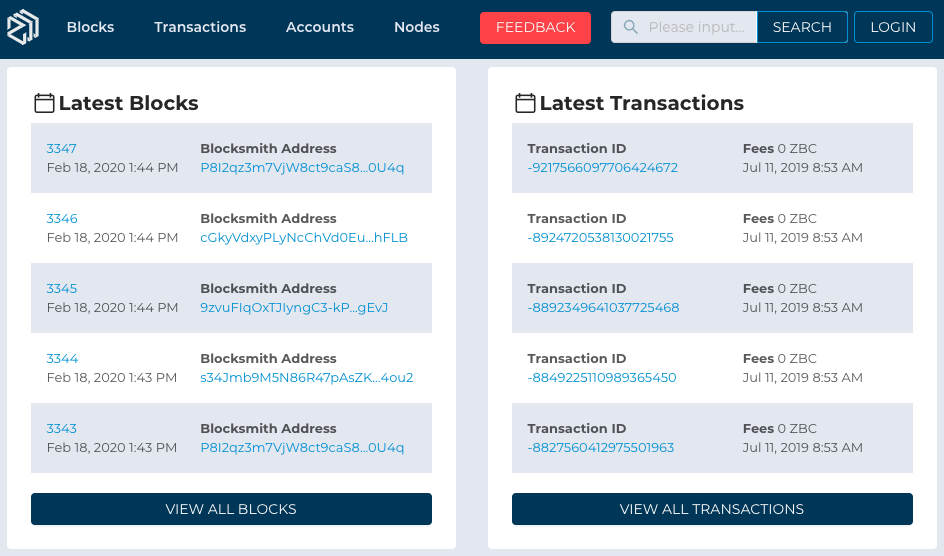
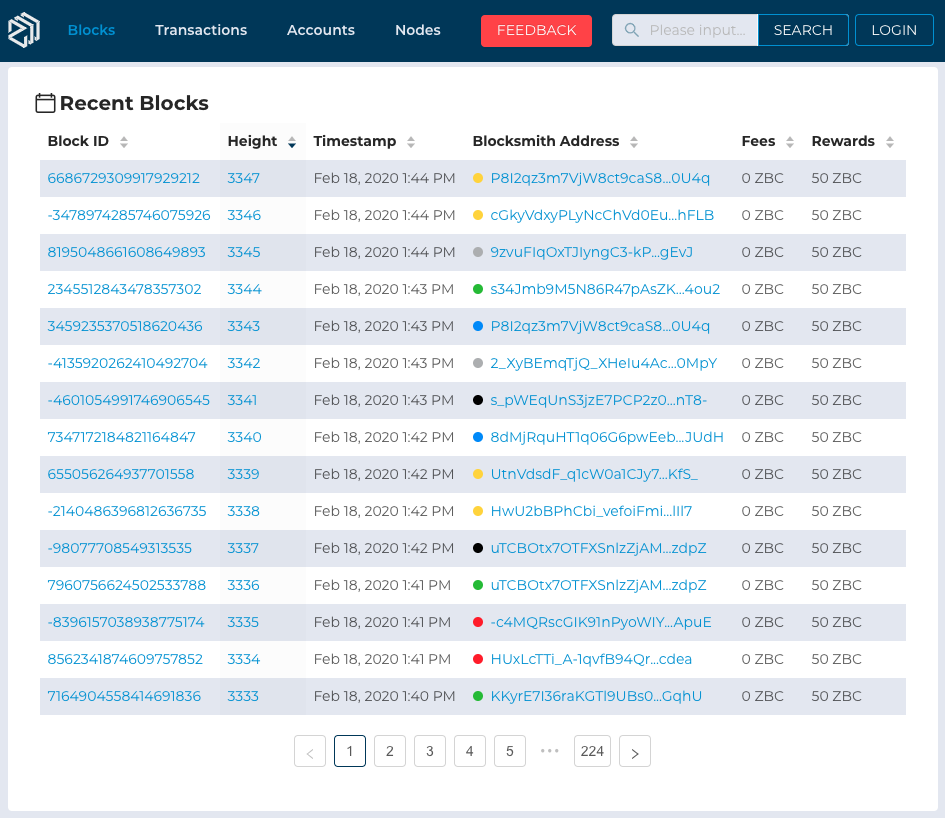
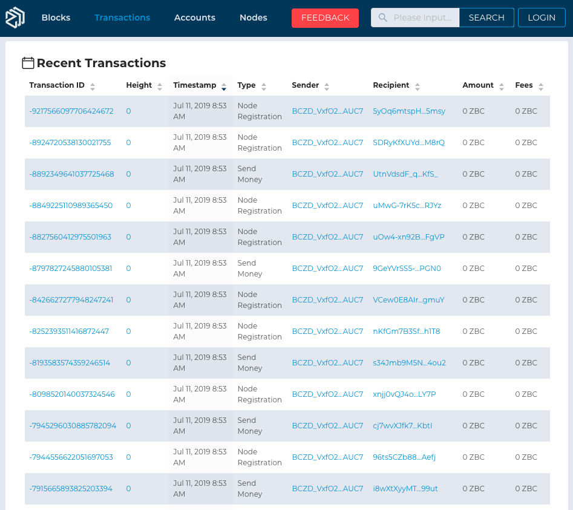
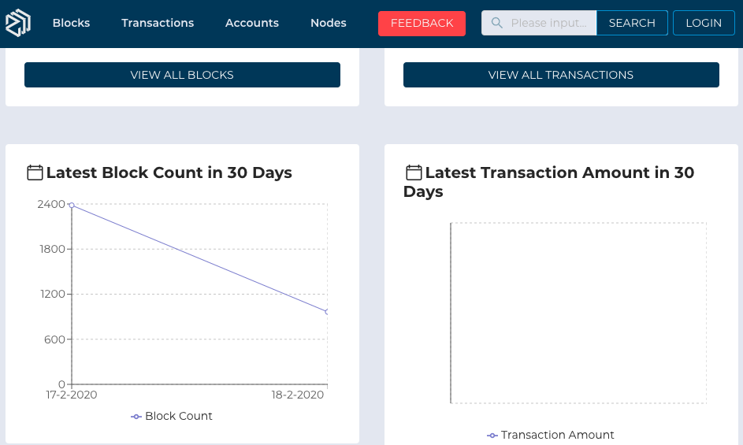
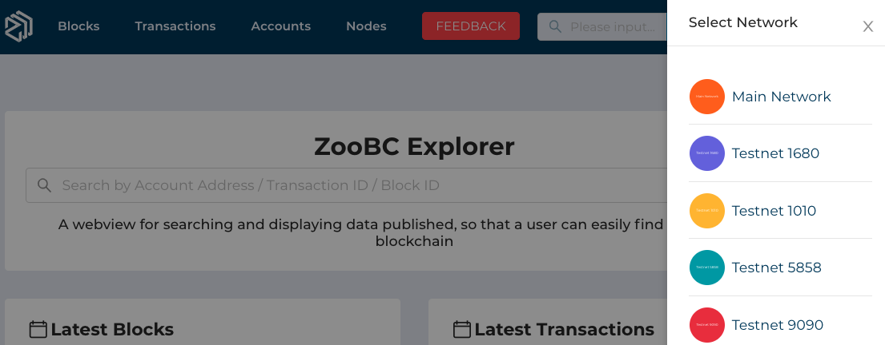

In this section we will explain what ZooBC Explorer is, what it consists of, what its fundamental idea and how it is designed.

## ZooBC Explorer Fundamentals

The ZooBC Explorer allows users to examine transactions, wallet addresses, browse blocks and other network information of the Test Network and Main Network blockchain.

It's a powerful tool with its main functionality to **search** in:

* **Blocks**
* **Transactions**
* **Accounts**
* **Nodes**

> ⚠️ __*Quicklinks*:__ Application URL [ZooBC Explorer][zoobc-net]

### The Explorer's Main Menu

  
__*Figure 1.2*__ : ZooBC Explorer's Main Menu

   
  

The screen header has four menu options and four elements __*(left to right)*__:

* ZooBC logo
* **Blocks**
* **Transactions**
* **Accounts**
* **Nodes**
* Button **FEEDBACK**
* Tab **SEARCH**
* Button **LOGIN**

### Homepage: Table of Latest Blocks and Transactions

  
__*Figure 1.3*__ : Table of Latest Blocks and Transactions

   
  

**Left table is Blocks Latest**

Blocks current state information:

* Block Height, _e.g._ `3355`
* Blocksmith Address, _e.g._ `P8I2qz3m7VjW8ct9caS8...0U4q`
* Timestamp, _e.g._ `Feb 20, 2020 1:44 PM`

**Right table of Transactions Latest**

Transactions current state information:

* Transaction ID, _e.g._ `-9217566097706424672`
* Fees, _e.g._ `0 ZBC`
* Timestamp, _e.g._ `Feb 20, 2020 1:44 PM`

`VIEW ALL ...` button at the each bottom of the table will directly show the recent of [**blocks**][blocks] and [**transactions**][transactions] with additional information.

**Recent Blocks**

  
__*Figure 1.4*__ : Table of Recent Blocks

   
  

**Recent Transactions**

  
__*Figure 1.5*__ : Table of Recent Transactions

   
  

### Homepage: Graph of Latest Blocks and Transactions (last 30 days)

The graph display large amounts of numerical data block count and transaction amount by variable date last 30 days.

  
__*Figure 1.6*__ : Graph of Latest Blocks and Transactions

   
  

* Blocks graph information about `Block Count` which are how many blocks can create every day.

* Transactions graph information about `Transaction Amount` which are calculate all amount transactions (BCZ currency) that created every day.

### Switch Explorer's Networks

  
__*Figure 1.7*__ : Select Networks

   
  

### **Related Topics**

* [Test Network][test-network]

* [Main Network][main-network]

* [API Documentation][api-documentation]

* [SDK Documentation][sdk-documentation]

[test-network]: https://docs.zoobc.net
[main-network]: https://docs.zoobc.net
[api-documentation]: https://docs.zoobc.net
[sdk-documentation]: https://docs.zoobc.net
[zoobc-net]: https://zoobc.net
[blocks]: https://zoobc.net/blocks
[transactions]: https://zoobc.net/transactions
