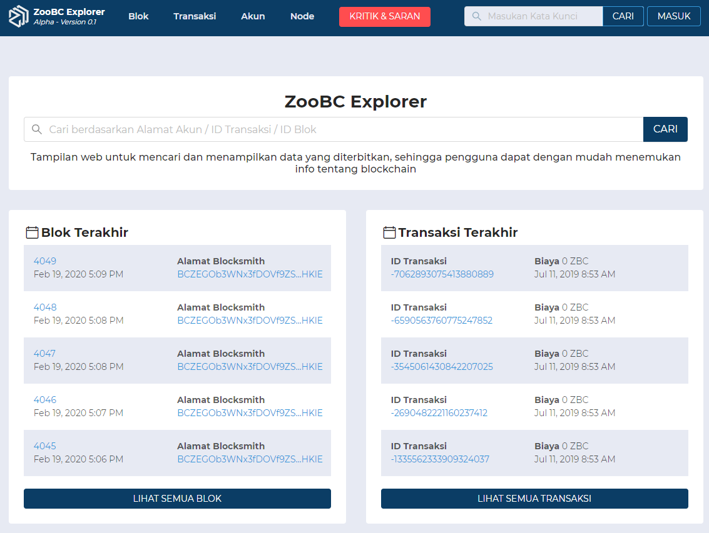

A Blockchain Explorer is a web application to view and query blocks working as a web browser that is
not connected to the internet, like Google Chrome, but to the Blockchain. Their primary function is
to allow everyone with an internet connection to track in real-time all the transactions or interactions
made by each cryptocurrencies holders, regardless of his or her level of knowledge and expertise.

## Learning the Basics

The Blockchain explorer allows the cryptocurrency operators to view data about blocks, addresses, and
other transactions on the bitcoin blockchain. The open source web-based block explorer may look
gibberish if one is new to cryptocurrency. but to an expert, it is some valuable information about
what goes on in a blockchain. It involves a lot of data that keeps rolling out constantly on your
computer screen.

The block explorer displays the latest blocks in the blockchain. When a new [ZooBC](https://zoobc.net/blocks)
block is discovered by a miner and posted on the network, it must be immediately listed by the block
explorers. This will enable a user to get more information about the size and when it was found and
what transactions it contains.

The block explorer also exhibits the hash of every block and can also give links to the earlier
generated blocks which too come with a hash as well as a history of transactions. It also works
as an information tool to learn the reward that a miner has earned for every network of the block.

Block explorers can also work as a search tool effectively for transaction IDs and wallet addresses.
It has become a highly reliable tool that people dealing with cryptocurrency depend on for any
information.

## Using the ZooBC Explorer

As every blockchain, also ZooBC has a block explorer. It is a work in progress, but you can use
the Alpha version of the block explorer to monitor the transactions you send and receive, and in
the overall the transactions send in the blockchain. As ZooBC has a very unique way of working,
due to the use of Proof of Participation, the block explorer also shows details that are specific
to this protocol.

When you first begin to use our block explorer, you may get to it from another source and end up on
an unfamiliar page. For the purposes of this tutorial, we will walk you through it from the main
[homepage](https://zoobc.net).

On the main home page you will see a search field to search by addresses, transactions or block hashes.
You will also see all and latest block information and transactions.

<small class="figure">Figure 1.1 ZooBC Explorer homepage</small>

* You can choose the menus like **_Blocks_**, **_Transactions_**, **_Accounts_**, and **_Nodes_**
that allows you to see all activity of transactions.

* On the red button called **_Feedback_** that allows you to give us some idea or better improvement
in the next release version.

* On the footer there is toggle **_Network_** that allows you to switch between TestNet or MainNet.

* Lorem ipsum

### Start using ZooBC Explorer [now](https://zoobc.net)

