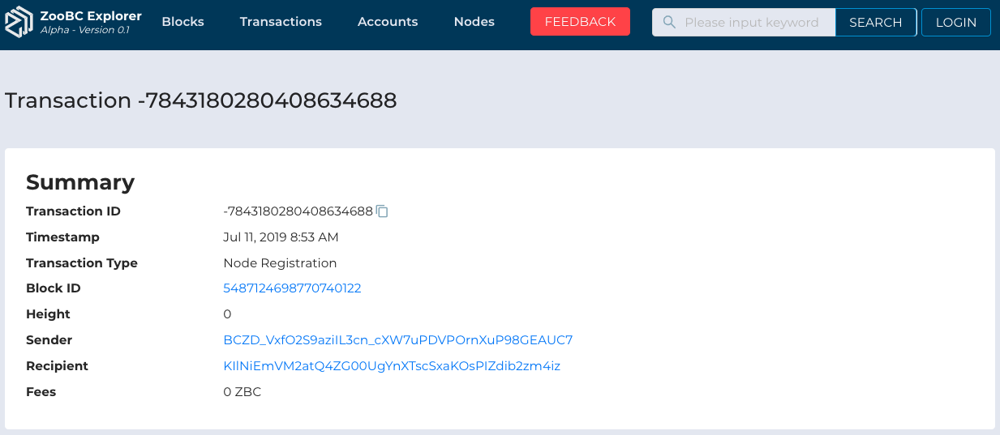
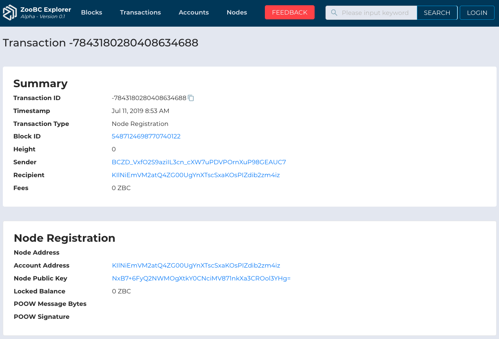
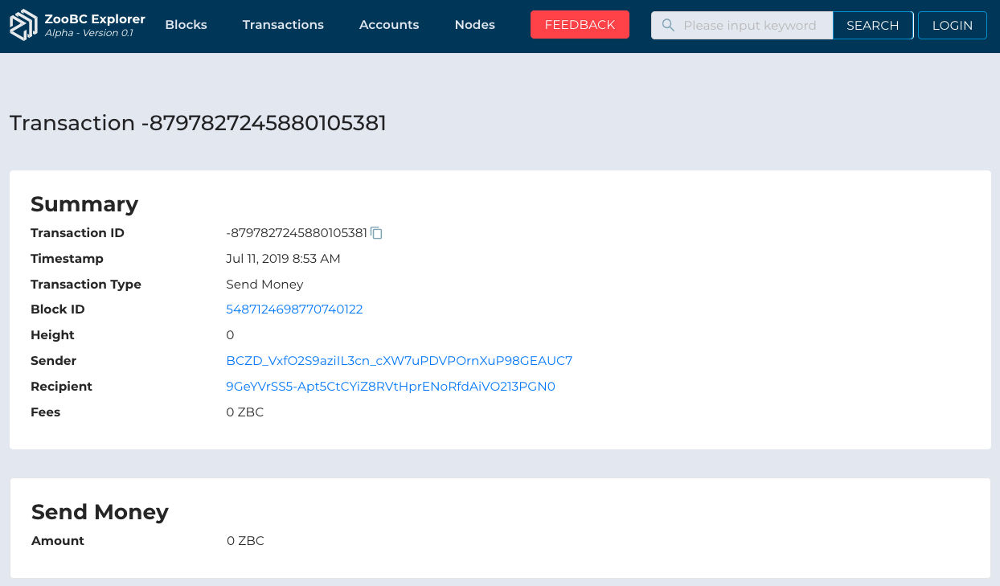

> 🔗 __*Quicklinks*:__ Application URL of [Transaction Detail][transaction-detail]

> ⚠️ These properties are still develop on our ZooBC Core, so if there's an empty value we use status `undefined`.

[transaction-detail]: https://zoobc.net/transactions/-7843180280408634688

## Properties

  
__*Figure 1.13*__ : Properties of Transaction Detail

   
  

* **Transaction ID** : Lorem ipsum dolor sit amet, consectetur adipiscing elit, sed do eiusmod tempor incididunt ut labore et dolore magna aliqua. _e.g._ `-7944556622051697053`.

* **Timestamp** : Lorem ipsum dolor sit amet, consectetur adipiscing elit, sed do eiusmod tempor incididunt ut labore et dolore magna aliqua. _e.g._ `Jul 11, 2019 8:53 AM`.

* **Transaction Type** : Lorem ipsum dolor sit amet, consectetur adipiscing elit, sed do eiusmod tempor incididunt ut labore et dolore magna aliqua. _e.g._ `Node Registration` or `Send Money`.

* **Block ID** : Lorem ipsum dolor sit amet, consectetur adipiscing elit, sed do eiusmod tempor incididunt ut labore et dolore magna aliqua. _e.g._ `5487124698770740122`.

* **Height** : Lorem ipsum dolor sit amet, consectetur adipiscing elit, sed do eiusmod tempor incididunt ut labore et dolore magna aliqua. _e.g._ `0`.

* **Sender** : Lorem ipsum dolor sit amet, consectetur adipiscing elit, sed do eiusmod tempor incididunt ut labore et dolore magna aliqua. _e.g._ `BCZD_VxfO2S9aziIL3cn_cXW7uPDVPOrnXuP98GEAUC7`.

* **Recipient** : Lorem ipsum dolor sit amet, consectetur adipiscing elit, sed do eiusmod tempor incididunt ut labore et dolore magna aliqua. _e.g._ `96ts5CZb88dO2HNRUyRyLWUlLv1YY0r9cTPlxB6sAefj`.

* **Fees** : Lorem ipsum dolor sit amet, consectetur adipiscing elit, sed do eiusmod tempor incididunt ut labore et dolore magna aliqua. _e.g._ `0 ZBC`.

## Node Registration

  
__*Figure 1.14*__ : Properties of Transaction Type as Node Registration

   
  

* **Node Address** : Lorem ipsum dolor sit amet, consectetur adipiscing elit, sed do eiusmod tempor incididunt ut labore et dolore magna aliqua. _e.g._ `undefined`.

* **Account Address** : Lorem ipsum dolor sit amet, consectetur adipiscing elit, sed do eiusmod tempor incididunt ut labore et dolore magna aliqua. _e.g._ `96ts5CZb88dO2HNRUyRyLWUlLv1YY0r9cTPlxB6sAefj`.

* **Node Public Key** : Lorem ipsum dolor sit amet, consectetur adipiscing elit, sed do eiusmod tempor incididunt ut labore et dolore magna aliqua. _e.g._ `HfNF5/MNM+/kCh2CGmvfE0hJQBA7d+rDJqMt1K9algU=`.

* **Locked Balance** : Lorem ipsum dolor sit amet, consectetur adipiscing elit, sed do eiusmod tempor incididunt ut labore et dolore magna aliqua. _e.g._ `0 ZBC`.

* **POOW Message Bytes** : Lorem ipsum dolor sit amet, consectetur adipiscing elit, sed do eiusmod tempor incididunt ut labore et dolore magna aliqua. _e.g._ `undefined`.

* **POOW Signature** : Lorem ipsum dolor sit amet, consectetur adipiscing elit, sed do eiusmod tempor incididunt ut labore et dolore magna aliqua. _e.g._ `undefined`.

## Send Money

  
__*Figure 1.15*__ : Properties of Transaction Type as Send Money

   
  

* **Amount** : Lorem ipsum dolor sit amet, consectetur adipiscing elit, sed do eiusmod tempor incididunt ut labore et dolore magna aliqua. _e.g._ `0 ZBC`.
